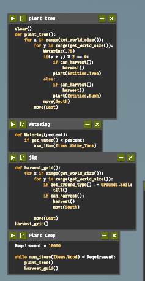

# -Programming the Farming Drone Report-
## Introduction 
- The Farmer Was Replaced is a programming game where we control a farming drone, telling it to plant and harvest crops, add water and 
fertilizer, etc. The game The Famer Was Replace is mainly based on understanding the problem and writing codes to slove. Program and 
optimize a drone to automate a farm and watch it do the work for us. Collect resources to unlock better technology and become the most 
efficient farmer in the world. Improve our problem solving and coding skills.

- Overview
I started with a small piece of land, learning how to plant crops and take care of them. The game was easy to pick up, and I felt the 
pressure of each choice I made. I had to plant crops while being aware of automated harvesters. At first, I’m just trying to plant basic 
crops and learn. I start with a few seeds . The controls are simple, so I quickly get the hang of watering, planting, and harvesting. Every 
decision feels important as if we did one mistake it can harms other codes.

# Table of Contents
- [Code Snippets and Explanation]
- [Challenges and Learnings]
- [References]

# Code-Snippets-and-Explanation
## Step 1: Farming on 1 tile
*Code:*
python
harvest()
do a flip()

- This code harvest the hay and it will flip after one harvest. After collecting more hay we can unlock the while loop code where the code 
will harvest continously

*After being unlocked while True*
python
while True:
   if can_harvest():
      harvest()

- After unlocking the while loop code it will continusely harvest. And can_harvest will harvest the plant that are fully grown.

*Notes*
- Using the code above I was able to get enough hay to unlock the tile
- These features were unlocked too: while.

## Step 2: Farming on 3x1 tile
*Code*
python
while True:
	harvest()
	do_a_flip()
	move(North)

- After upgrading 3x1 tiles we will get a new code (move) where this code will command the drone to move north and harvest after being moved.
- To upgrade 3x3 tiles we need a bush and a hay so to do that we need to plant a bush. To do that we have a code below.

*Code*
python
while True:
   if can_harvest():
      harvest()
      plant(Entities.Bush)
      move(North)

*Notes*
- Using the code above I was able to get enough bush to unlock carrots 
- These features were unlocked too: if, for, get_world_size, senses and etc...

## Step 3: Farming on 3x3 tile
*Code*
python

* In this script, I set up an infinite loop so that my actions repeat continuously, keeping my automated system running without stopping. I start by moving across the grid horizontally, step by step, to the east. With each move, I make sure to trade for carrot seeds so that I always have enough seeds for planting.

* Once I've moved as far as I can in the east direction, I switch to moving vertically across the grid. As I move up and down, I keep an eye on my wood supplies. If I have less than 2000 units of wood, I check if there’s anything ready to harvest. If there is, I harvest it and then plant a bush to keep resources growing. After planting, I continue moving either north or south, depending on where I am on the grid, and I harvest again if I come across anything ready. This way, I’m constantly collecting resources, planting, and staying stocked up on wood.

*Code*
while True:
	for x in range(get_world_size()):
		move(East)
		trade(Items.Carrot_Seed)
		for y in range(get_world_size()):
			if num_items(Items.Wood) < 2000:
				if can_harvest():
					harvest()
				plant(Entities.Bush)
				move(North)
				if can_harvest():
					harvest()
				else:
					move(South)

*Notes*
- Using the code above I was able to get enough carrots and bush where it help me to unlock the tiles 
- These features were unlocked too: Debug, operator, varables and functions.

## Step 4: Farming on 4x4 tile

### Operators
Symbols for operations (e.g., +, -, ==).
### Variables
Named storage for values.
### Functions
Reusable code blocks that perform tasks (e.g., def greet(name):)

* this are the overview of the 4x4 tiles.In this case from the first we have f5 in this cpde i have given a variable to the given items and entities.
and used while loops.this codes shows how much we need carrots and how much we can trade our logs withh the carrot seeds

* in the f6 code I wrote controls my movement through a grid, starting with a move south. In a continuous loop, I move east across each row. Within each column, I move north, checking if there’s anything to harvest—and if there is, I harvest it. I keep an eye on my water tank supplies; if I have fewer than 100 empty tanks, I trade for more. If my water level drops below .75, I refill using a water tank. Once I’ve covered a column, I move east to the next one and repeat the whole process
*code*
move(South)
while True:
	for x in range(get_world_size()):
		move(North)
		if can_harvest():
			harvest()
			if num_items(Items.Water_Tank) < 100:
				trade(Items.Empty_Tank)
			if get_water() < 0.75:
				use_item(Items.Water_Tank)
	move(East)	
			

* In this code, I created several functions to manage different tasks on my farm efficiently. The main function, plant_tree, is responsible for moving across the grid and planting trees in specific spots. As I go through each row and column, I check if the coordinates meet certain conditions (in this case, x % 3 == 0 and y % 2 == 0). If they do, I plant a tree and harvest any resources that are ready. If a spot doesn’t meet these conditions, I plant a bush instead. After each planting action, I adjust my movement—either moving south within a column or moving east to the next column.

*code*
clear()
def plant_tree():
	for x in range(get_world_size()):
		for y in range(get_world_size()):
			Watering(.75)
			if(x + y) % 2 == 0:
				if can_harvest():
					harvest()
				plant(Entities.Tree)
			else:
				if can_harvest():
					harvest()
				plant(Entities.Bush)
			move(South)
		move(East)
			

* I also created a Watering function that checks the water level and refills it by a specified percentage if it’s too low. This helps keep the crops watered as I work across the grid. Then, I have a harvest_grid function that goes through the entire grid, checking each cell to see if there’s anything ready to harvest. Before harvesting, I make sure the ground type is suitable by tilling if necessary.

*code*
def Watering(percent):
	if get_water() < percent:
		use_item(Items.Water_Tank)

* Finally, I connected these functions to form a larger sequence. The Plant Crop section uses a while loop to run plant_tree and harvest_grid repeatedly until I’ve reached a specific wood requirement (10,000 units). This way, my code keeps planting, watering, and harvesting in a loop, creating a self-sustaining system that achieves my resource goals. By structuring it this way, each function handles a specific task, and they all work together to keep the farm running smoothly

*code*
def harvest_grid():
	for x in range(get_world_size()):
		for y in range(get_world_size()):
			if get_ground_type() != Grounds.Soil:
				till()
			if can_harvest():
				harvest()
				move(South)
		
		move(East)
harvest_grid()

*Notes*
- Using the code above I was able to get enough pumpkins and upgraded the tiles 

# Challenges and Learnings
## Challenges
- The challange that i face were getting the code correct to run and loops where it could harvest continuse and some challange are time too as i have to wait until i meet the need to unlock or upgrade.
- some challenge can be also laptop heat up as we have to wait until it fulfull the need it takes more time and laptop batterys consume more and gets more heat up.
- As there is limitd clues it was harder for us to know to code to command correctly and as there is different references with different solutions it was challanging for us to understand it.
## Learnings
- While playing this game i have learn to check errors and it helped me to gain more knowlege on loops, variables, operator and etc...
- And this game also helped in developing our planning stratiges as befor we harvest we need to know should it haevest and when to harvest.
- As the game it self us mainly based on programing it aims to develop more knowledge on programming and helped us to maintain a Adaptability
## References
- Youtube
https://www.youtube.com/watch?v=-hdhyKf2aN8&list=PLateWiNrGEtoIy8aeWse6dQOCToetjXJg
